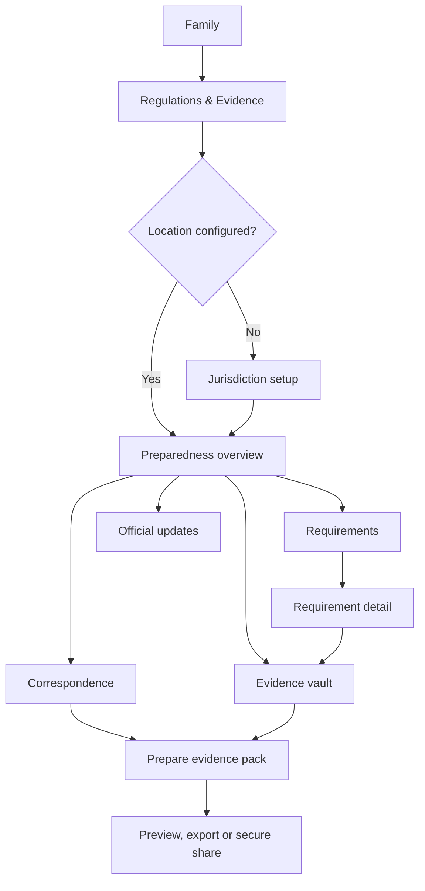
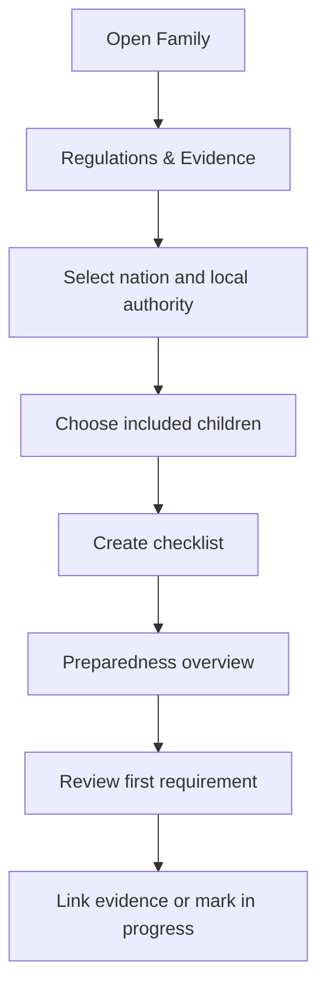
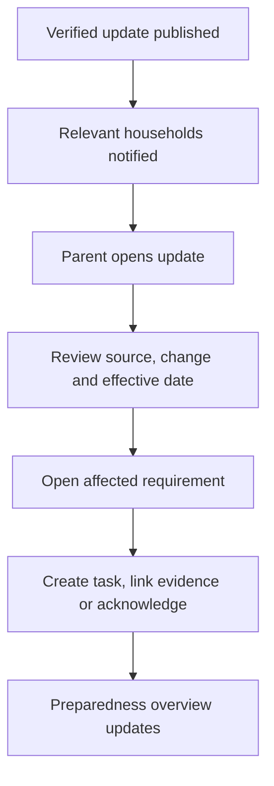
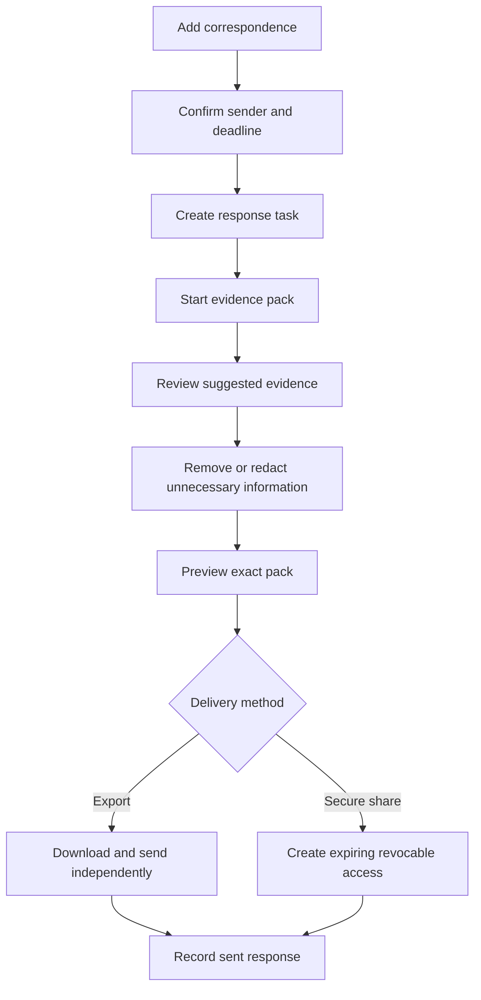

# NexSteps Home Regulations & Evidence

| Field            | Value                                         |
| ---------------- | --------------------------------------------- |
| Owner            | Product Design / Virtual CTO                  |
| Status           | Approved product specification                |
| Created          | 28 July 2026                                  |
| Last updated     | 28 July 2026                                  |
| Primary surface  | Expo React Native mobile app                  |
| Initial coverage | England, Wales, Scotland and Northern Ireland |

**Canonical handoff:** [NexSteps Home Implementation Handoff](README.md)

**Related documents:**

- [Phase 7 — NexSteps Home](../07-nexsteps-home.md)
- [Community and family user flows](community-user-flows.md)
- [Implementation map](implementation-map.md)

## 1. Executive summary

NexSteps Home will add a **Regulations & Evidence** area within `Family`. It
will help home-educating parents understand which official requirements may
apply to their household, organise supporting evidence, track correspondence
and deadlines, and prepare a controlled evidence pack when information needs to
be shared.

The feature is a **Verified Preparedness Hub**, not an automated legal adviser.
It must never certify a household as legally compliant, guarantee the right to
home educate, or turn unreviewed community content into guidance. Every
requirement and change summary must be tied to an authoritative source,
jurisdiction, effective date, verification state and review date.

The underlying model is global: country, first-level jurisdiction and local
authority are separate layers. The first live content release covers all four
UK nations without mixing their guidance.

## 2. Approved product decisions

1. The feature is named **Regulations & Evidence** in navigation.
2. The opening screen uses the parent-facing heading **Stay prepared for home
   education requirements**.
3. Launch content covers England, Wales, Scotland and Northern Ireland.
4. Nation selection is required; local authority selection is requested when
   relevant.
5. The app displays **preparedness**, never a legal compliance score.
6. High-impact change summaries require human editorial review before release.
7. Community discussions remain separate and cannot create or edit regulatory
   requirements.
8. Existing private learning evidence is referenced rather than duplicated.
9. Sharing is deliberate, scoped, revocable and private by default.
10. The first visit teaches through a short setup task, not a tutorial.

## 3. Problem statement

Home-educating families may need to interpret national guidance, understand
local processes, retain learning records, respond to correspondence and show
how a suitable education is being provided. These materials are often spread
across email, photo libraries, cloud folders and paper files. Changes to
legislation or official guidance can also be difficult to discover and assess.

NexSteps Home should give parents one calm place to:

- see relevant, verified official information;
- understand what has changed and when;
- decide what preparation action to take;
- link existing learning records to a requirement;
- store letters and response history;
- assemble only the evidence needed for a specific request;
- retain control over what is shared and with whom.

## 4. Goals

- A parent can identify the next preparedness action within five seconds.
- Jurisdiction setup takes under one minute.
- A document can be uploaded and linked in three steps.
- An official update clearly shows its source, applicability and review state.
- A parent can prepare a scoped evidence pack in under two minutes.
- No screen implies that NexSteps has made a legal determination.
- Nation-specific guidance is never silently combined.
- Every view, download and share of sensitive evidence is authorised and
  auditable.

## 5. Non-goals

- Legal advice or legal representation.
- A guarantee of compliance or continued permission to home educate.
- Predicting the outcome of a local-authority enquiry.
- Automatically responding to a government body.
- Scraping arbitrary websites and presenting the result as verified guidance.
- Allowing community members to publish requirements.
- A public document profile or permanent public evidence link.
- Replacing the family's complete household-data export.
- Duplicating the Progress evidence gallery.
- Scoring or ranking children, families or educational philosophies.

## 6. Product and content principles

### 6.1 Calm preparedness

Use `Prepared`, `In progress`, `Needs review` and `Not reviewed`. Avoid
`Compliant`, `Non-compliant`, `Violation`, red threat banners and countdown
language unless an actual user-entered deadline is approaching.

### 6.2 Official source first

Every requirement and update displays:

- issuing body;
- jurisdiction;
- source title and link;
- publication or effective date when available;
- last verified date;
- verification state;
- a short explanation of what the source means for the current household.

The official source remains accessible even when a plain-English summary is
available.

### 6.3 Separate fact, interpretation and parent choice

The UI visually distinguishes:

- **Official information:** sourced fact or published guidance.
- **NexSteps summary:** reviewed explanation written for clarity.
- **Your preparation:** a parent-controlled status, note, task or evidence link.

### 6.4 Evidence remains evidence

Uploading a file does not prove a requirement has been met. The parent decides
whether an item is relevant. NexSteps records the link and history without
making a legal judgement.

### 6.5 No tutorial

The initial empty state contains one useful action: `Set my location`. After
jurisdiction setup, it becomes the permanent preparedness overview.

## 7. Information architecture

The permanent bottom navigation remains:

`Week · Today · Community · Progress · Family`

`Family` adds a prominent row:

```text
Regulations & Evidence
Stay prepared and keep important records together
[2 actions to review]
```

Inside the feature, a compact local switcher provides:

- `Overview`
- `Requirements`
- `Evidence`
- `Updates`

Correspondence and evidence packs are reached from Overview and Evidence. This
avoids adding more items to the app-wide tab bar.



## 8. Jurisdiction model and launch scope

### 8.1 Global structure

The content hierarchy is:

1. Country
2. First-level jurisdiction, such as nation, state or province
3. Local authority or equivalent administrative area
4. Household and child applicability

The schema must allow a jurisdiction to be configured before its content is
enabled. Users cannot select unpublished or unreviewed jurisdiction content as
if it were complete.

### 8.2 UK launch

The first release enables:

- England;
- Wales;
- Scotland;
- Northern Ireland.

Each nation has its own source collection, requirement versions and content
review state. A household sees only the selected nation's content, plus a
clearly labelled local-authority overlay where verified material exists.

### 8.3 Location changes

Changing nation or local authority:

1. explains which checklist items may change;
2. archives, but does not delete, prior preparedness states;
3. preserves all evidence and correspondence;
4. rebuilds the active checklist from the new jurisdiction;
5. records the change in the household audit history.

## 9. Screen specifications

### 9.1 Family entry card

**Purpose:** make preparedness discoverable without turning Family into a dense
settings list.

**Content:**

- shield-and-folder icon from the approved icon library;
- `Regulations & Evidence`;
- one-line benefit statement;
- calm status badge;
- chevron indicating a destination.

**Primary action:** open the hub.

### 9.2 Jurisdiction setup

**Heading:** `Show guidance for your family`

**Fields:**

1. Country, preselected as United Kingdom for launch.
2. Nation.
3. Postcode or local-authority search, with an option to choose manually.
4. Children to include.
5. Toggle for official-update notifications.

The postcode is used only to resolve the local authority and is not displayed
in Community. The screen explains this at the point of entry.

**Primary action:** `Create my checklist`.

### 9.3 Preparedness overview

**Heading:** `Stay prepared`

The screen contains:

- one calm status panel;
- `Next action`, always the most relevant primary card;
- `Requirements` progress by parent-controlled state;
- `Evidence coverage`, expressed as linked/not linked rather than a score;
- latest verified update;
- next correspondence deadline;
- shortcuts to Evidence and Correspondence.

Examples:

- `Nothing urgent — 6 items prepared`
- `Review one updated guidance item`
- `Response due in 9 days`

There is one mint primary button matching the next action. Yellow highlights one
current-focus item, consistent with the existing NexSteps Home visual system.

### 9.4 Requirements list

Filters:

- `Needs review`
- `In progress`
- `Prepared`
- `All`
- child

Each requirement row shows:

- short title;
- official or local-authority label;
- applicable child or household;
- status;
- effective date or user-entered deadline where relevant;
- source freshness.

The default order is urgent user deadlines, changed requirements, not reviewed,
in progress, then prepared.

### 9.5 Requirement detail

Sections:

1. `What this means`
2. `Who this applies to`
3. `How you can prepare`
4. `Evidence you have linked`
5. `Official source`
6. `Verification history`

Actions:

- set or change preparedness status;
- add a private note;
- link existing evidence;
- upload new evidence;
- create a task;
- open the official source.

If content is stale, the summary is de-emphasised and the official-source link
becomes the primary action.

### 9.6 Evidence vault

The vault is a regulations-focused view over the existing private evidence
store. It does not copy files from Progress.

Categories:

- education approach or plan;
- learning samples;
- progress reports;
- support needs;
- correspondence;
- previous evidence packs;
- other.

Filters:

- child;
- requirement;
- date range;
- category;
- linked or unlinked.

Each item shows its owner, date range, links, version and sharing state.

### 9.7 Upload and classify evidence

Sources:

- camera scan;
- photo library;
- device file;
- existing NexSteps evidence;
- correspondence import.

Steps:

1. Select or capture.
2. Confirm title, child, date range and category.
3. Link to one or more requirements, or save unlinked.

The app scans uploaded files before making them available. A failed or pending
scan never appears in an evidence pack.

### 9.8 Updates feed

Feed items are scoped to the household's active jurisdiction and children.

Each card shows:

- `New`, `Changed`, `Effective soon` or `Correction`;
- issuing body;
- what changed;
- possible household impact;
- effective date;
- verification date.

The feed does not use engagement ranking. It is ordered by impact and effective
date, then publication date.

### 9.9 Update detail

Sections:

1. reviewed plain-English summary;
2. previous and current wording where a meaningful comparison is available;
3. potentially affected checklist items;
4. suggested preparation actions;
5. official source and source history.

**Primary action:** `Review affected requirement`.

Parents can acknowledge an update without marking any requirement prepared.

### 9.10 Correspondence

Each item stores:

- sender and issuing body;
- received date;
- child or household scope;
- original document;
- response deadline;
- status;
- private notes;
- related tasks;
- sent-response evidence.

Statuses are `Received`, `Reviewing`, `Preparing response`, `Responded` and
`Closed`.

Uploading correspondence may suggest fields, but the parent confirms all
extracted information before it is saved.

### 9.11 Prepare evidence pack

**Entry points:** Correspondence, Requirement detail, Evidence vault and Reports.

Steps:

1. Choose the request, child and date range.
2. Review suggested evidence.
3. Add or remove items.
4. Preview the cover summary and attachment order.
5. Remove or redact unnecessary information.
6. Export locally or create a secure share.

The suggestion engine uses explicit evidence links and metadata only. It does
not infer sensitive facts or add unrelated household records.

### 9.12 Pack preview and sharing

The preview shows exactly what the recipient will receive:

- cover page;
- family-supplied context;
- evidence index;
- selected reports and learning samples;
- selected correspondence;
- source and preparation dates.

Secure sharing:

- named recipient or parent-recorded recipient label;
- short expiry, seven days by default;
- optional passcode delivered separately;
- revoke at any time;
- view and download audit;
- no search indexing;
- no unauthenticated permanent URL.

Export remains available for families who prefer to send the pack themselves.

## 10. Core user flows

### 10.1 First use



### 10.2 Respond to an official change



### 10.3 Prepare for an information request



## 11. Roles and permissions

### Household Owner

- Manages jurisdiction and notification defaults.
- Can see and manage all included children's regulatory evidence.
- Can create, export and share evidence packs.
- Can grant or remove preparedness permissions.

### Adult Guardian

- Sees only linked children.
- Can upload and link evidence when granted edit access.
- Can prepare a pack for an authorised child.
- Cannot widen their own access.

### Tutor or Mentor

- Has no Regulations & Evidence access by default.
- May upload a learning item into Progress if separately authorised.
- Cannot view correspondence, regulatory notes or evidence packs.

### Platform Content Reviewer

- Manages source records, requirement versions and reviewed summaries.
- Cannot access household evidence or correspondence.
- Every publish, correction and withdrawal is audited.

### Support and operations

- Cannot browse household documents by default.
- Time-limited break-glass access requires a support case, explicit reason,
  elevated approval and audit.

## 12. Content verification and update pipeline

1. Register an authoritative source and owning jurisdiction.
2. Fetch or manually capture a new source version.
3. Detect a potential change.
4. Record the exact source material and timestamps.
5. Draft a plain-English summary.
6. Review applicability, wording, effective date and affected requirements.
7. Approve with a named reviewer and second-person review for high-impact
   changes.
8. Publish the requirement version or update.
9. Notify only affected households.
10. Retain prior versions and correction history.

Automated monitoring may detect changes, but it cannot publish a legal summary
without review. If a source becomes unavailable or has not been reverified
within its review window, show `Source needs reverification` and stop issuing
confident summaries from it.

Initial authoritative source collections include:

- GOV.UK Department for Education material for England;
- GOV.WALES material for Wales;
- gov.scot and mygov.scot material for Scotland;
- Northern Ireland Department of Education and nidirect material.

Local-authority material is enabled only after the source and ownership have
been verified.

## 13. Data model

The implementation should extend the existing tenant-isolated household and
Evidence domains with focused entities.

### Jurisdiction

- `id`
- `countryCode`
- `subdivisionCode`
- `name`
- `level`
- `parentJurisdictionId`
- `contentStatus`

### RegulatoryAuthority

- `id`
- `jurisdictionId`
- `name`
- `authorityType`
- `officialDomain`

### RegulatorySource

- `id`
- `authorityId`
- `title`
- `canonicalUrl`
- `sourceType`
- `publishedAt`
- `effectiveAt`
- `lastCheckedAt`
- `verificationState`
- `contentHash`

### Requirement and RequirementVersion

- stable requirement identity;
- jurisdiction and applicability rule;
- reviewed title and summary;
- source references;
- effective interval;
- preparation suggestions;
- reviewer and approval timestamps.

### HouseholdRequirement

- `tenantId`
- `requirementId`
- optional `childId`
- parent-controlled status;
- notes;
- acknowledged version;
- optional deadline;
- audit timestamps.

### EvidenceLink

- existing `evidenceId`;
- `householdRequirementId` or `correspondenceId`;
- link purpose;
- linked by and linked at.

### Correspondence

- tenant and optional child;
- sender;
- received and response dates;
- status;
- original evidence asset;
- notes and task references.

### EvidencePack and EvidencePackItem

- tenant, child and correspondence scope;
- immutable pack version after finalisation;
- ordered evidence references;
- redaction derivative references;
- generated-file state;
- creator and audit timestamps.

### EvidencePackShare

- recipient label;
- hashed access token;
- expiry;
- revoked timestamp;
- access policy;
- view and download audit.

All tenant-owned rows include the existing tenant boundary and authorisation
checks. Cross-household joins are prohibited.

## 14. API boundaries

Recommended mobile-facing endpoints:

- `GET /family/regulations/overview`
- `GET /family/regulations/requirements`
- `GET /family/regulations/requirements/:id`
- `PATCH /family/regulations/requirements/:id/preparedness`
- `GET /family/regulations/updates`
- `GET /family/regulations/updates/:id`
- `GET /family/regulations/evidence`
- `POST /family/regulations/evidence-links`
- `POST /family/regulations/correspondence`
- `PATCH /family/regulations/correspondence/:id`
- `POST /family/regulations/evidence-packs`
- `POST /family/regulations/evidence-packs/:id/finalise`
- `POST /family/regulations/evidence-packs/:id/shares`
- `DELETE /family/regulations/evidence-packs/:id/shares/:shareId`

All identifiers are opaque. The API validates tenant, child and evidence access
at every boundary and never trusts a client-provided tenant ID.

Content-review APIs are isolated from household APIs and require a dedicated
platform role.

## 15. Security, privacy and retention

- Encrypt evidence, correspondence, packs and sensitive metadata at rest and in
  transit.
- Use malware scanning and quarantine before a file becomes available.
- Store generated redactions as controlled derivatives; preserve the original.
- Use short-lived signed object access behind application authorisation.
- Record upload, view, download, link, export, share and revoke events.
- Do not place document contents, names or contact details in analytics events.
- Exclude regulatory documents and correspondence from Community APIs,
  indexing and recommendation systems.
- Keep local mobile caches encrypted and minimise cached document content.
- Apply explicit retention schedules and legal-hold handling.
- Include regulatory data in household and child data exports.
- Explain deletion consequences when evidence is referenced by a finalised pack.
- Back up encrypted records and test restore procedures.
- Process household data in the configured UK/EU region.

## 16. Notifications

Notification categories:

- verified official change;
- effective date approaching;
- parent-entered response deadline;
- evidence-pack share viewed or downloaded;
- source correction or withdrawal;
- security event affecting a share.

Defaults:

- deadline and security alerts are immediate;
- ordinary guidance changes use a restrained digest;
- users can disable update marketing-style notifications;
- material corrections to previously viewed guidance cannot be fully hidden.

Notification copy states the jurisdiction and never exposes child or document
details on a lock screen.

## 17. Empty, stale and failure states

### No location

`Choose your nation to see relevant official information.`

Primary action: `Set my location`.

### No local-authority content

Show national guidance normally and state that no verified local overlay is
currently available. Do not imply that no local process exists.

### No evidence

`Keep useful records together when you need them.`

Primary action: `Add evidence`.

### Source stale or unavailable

Show the last verification date and an explicit warning. Prioritise the official
source or alternative authoritative source. Do not present a stale summary as
current.

### Upload scanning

Show `Checking file` with progress. The user may leave the screen. Notify on
completion or failure.

### Pack generation failure

Keep the selected items and redactions. Offer `Try again`; never require the
parent to rebuild the pack.

### Offline

Allow access to previously cached metadata and draft notes where safe. File
upload, new share creation and final pack generation wait for confirmed network
success.

## 18. Accessibility and visual system

- Reuse the NexSteps Home white, mint `#76D7C4`, yellow `#FFD166` and charcoal
  `#333333` system.
- Use Nunito headings and Quicksand body text.
- Maintain at least 44x44pt touch targets.
- Never communicate preparedness only through colour.
- Use icons from the app's approved icon library, not custom approximations.
- Ensure document selection, status controls and pack ordering work with screen
  readers and switch control.
- Provide accessible text alternatives for scanned-document previews.
- Preserve dynamic type without clipping deadlines or status labels.
- Respect reduced motion.
- Do not use nested cards; use sections, dividers and one clear primary action.

## 19. Legal-safety copy

Persistent footer or information-sheet wording:

> NexSteps helps you organise official information and your family's evidence.
> It does not provide legal advice or guarantee compliance.

Update summaries use:

- `Official source`
- `NexSteps summary`
- `How you may wish to prepare`

They do not use:

- `You are legally safe`
- `You have satisfied the law`
- `Guaranteed protection`
- `This proves compliance`

## 20. Analytics and success measures

Track privacy-safe events only:

- jurisdiction setup completed;
- requirement opened;
- official source opened;
- preparedness status changed;
- evidence linked;
- correspondence deadline recorded;
- evidence pack finalised;
- pack exported or secure share created;
- share revoked;
- stale-source warning viewed.

Success measures:

- jurisdiction setup completion;
- percentage of relevant updates reviewed;
- time from correspondence upload to deadline confirmation;
- time to prepare a pack;
- pack-generation failure rate;
- percentage of shares revoked or expired correctly;
- zero cross-tenant evidence-access incidents;
- correction publication time after a source error is found.

No product metric should reward uploading unnecessary personal data.

## 21. Visual wireframe inventory

The clickable prototype should add the following screens:

1. Family with Regulations & Evidence entry
2. Jurisdiction setup
3. Preparedness overview
4. Requirements list
5. Requirement detail
6. Evidence vault
7. Upload and classify evidence
8. Updates feed
9. Update detail
10. Correspondence list
11. Correspondence detail
12. Add correspondence
13. Evidence-pack scope
14. Evidence selection
15. Pack preview and redaction
16. Export or secure share
17. Share confirmation and access activity

The primary clickable demonstration path is:

`Family → Regulations & Evidence → Review changed guidance → Open affected
requirement → Link evidence → Add correspondence → Prepare pack → Preview →
Secure share`.

Secondary paths cover:

- first-time jurisdiction setup;
- direct evidence upload;
- pack export without NexSteps sharing;
- stale-source warning;
- upload scan failure;
- revoking an active share.

## 22. Acceptance criteria

- [ ] A first-time parent can configure a UK nation and local authority without
      a tutorial.
- [ ] England, Wales, Scotland and Northern Ireland remain distinct content
      scopes.
- [ ] Every published requirement has at least one authoritative source,
      verification state and review date.
- [ ] High-impact updates cannot publish without the configured review.
- [ ] The app never labels a family legally compliant.
- [ ] Requirements can link to existing Evidence without copying the asset.
- [ ] Evidence and correspondence access is tenant- and child-authorised.
- [ ] Parents can prepare, preview and reduce a pack before export or sharing.
- [ ] Secure shares expire, can be revoked and produce access audit events.
- [ ] No document is included in a pack while malware scanning is pending or
      failed.
- [ ] Community members cannot create official requirements or access evidence.
- [ ] Loading, empty, offline, stale-source, permission, upload-failure and
      pack-generation-failure states are implemented.
- [ ] Core screens satisfy WCAG 2.2 AA and mobile dynamic-type requirements.
- [ ] Unit, integration and end-to-end tests cover jurisdiction isolation,
      tenant isolation, version acknowledgement, evidence linking, pack
      generation and share revocation.

## 23. Risks and mitigations

| Risk                                | Mitigation                                                                                        |
| ----------------------------------- | ------------------------------------------------------------------------------------------------- |
| Incorrect or stale legal summary    | Official-source provenance, review windows, human approval, correction history and stale warnings |
| False confidence                    | Preparedness language, no compliance score and persistent legal-information disclaimer            |
| UK guidance mixed across nations    | Required nation scope and separate requirement versions                                           |
| Local-authority inconsistency       | Only enable verified overlays; label gaps without claiming no process exists                      |
| Excessive sensitive-data collection | Reuse existing evidence, data-minimising pack suggestions and explicit redaction                  |
| Accidental oversharing              | Exact preview, private defaults, short expiry, revoke and access audit                            |
| Malicious or unsafe files           | Quarantine, malware scanning and controlled derivatives                                           |
| Community misinformation            | Hard separation between Community content and verified regulatory content                         |
| Update alert fatigue                | Relevance filtering, materiality levels and restrained digests                                    |

## 24. Official launch references

The content operation should begin with these authoritative collections:

- [England — Elective home education, Department for
  Education](https://www.gov.uk/government/publications/elective-home-education)
- [Wales — Elective home education guidance, Welsh
  Government](https://www.gov.wales/elective-home-education-guidance-html)
- [Scotland — Home education guidance, Scottish
  Government](https://www.gov.scot/publications/home-education-guidance-2/pages/)
- [Northern Ireland — Elective home education, Department of
  Education](https://www.education-ni.gov.uk/articles/elective-home-education)
- [Northern Ireland — Educating your child at home,
  nidirect](https://www.nidirect.gov.uk/articles/educating-your-child-home)

These links seed the source registry; they are not a substitute for ongoing
content review.
