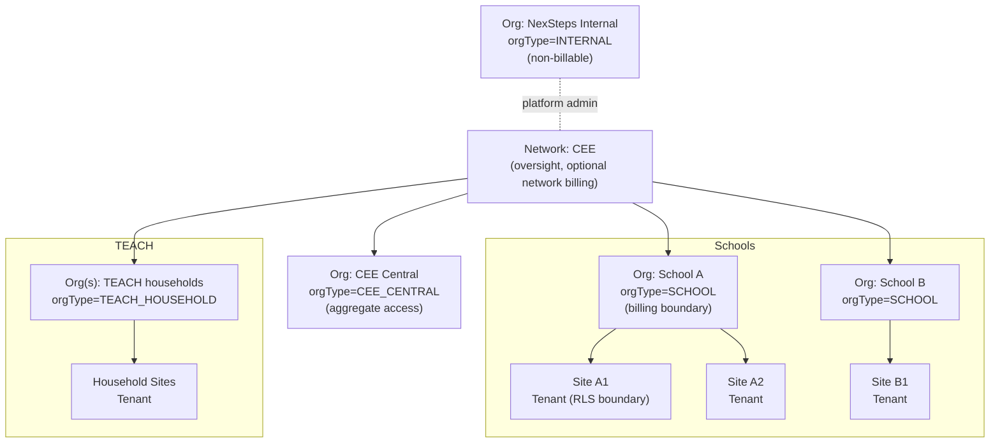
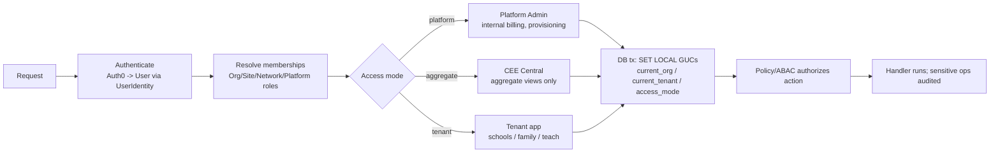
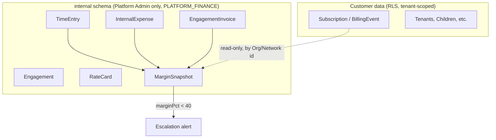

# Diagram source - Tenancy hierarchy and product surfaces

Rendered references appear in `01-architecture-overview.md` and `02-multi-tenancy-and-scalability.md`. Source kept here as Mermaid for editing.

## Tenancy hierarchy

## Surface resolution and access modes

## Internal staff billing isolation

