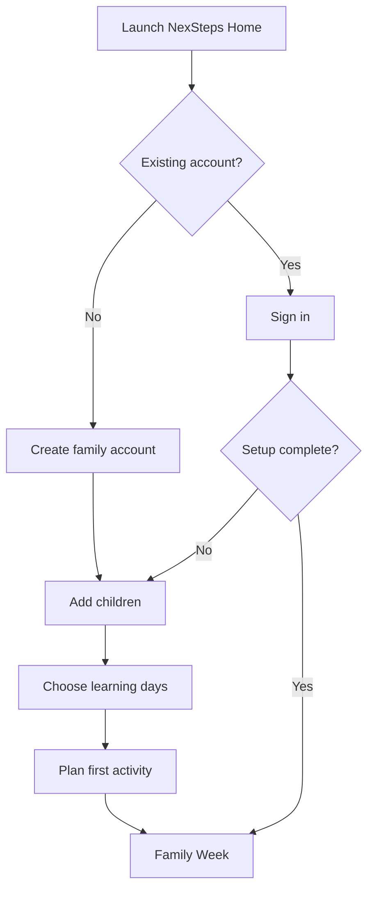
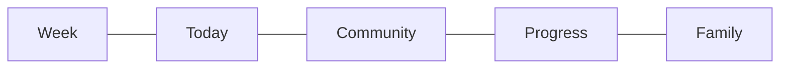
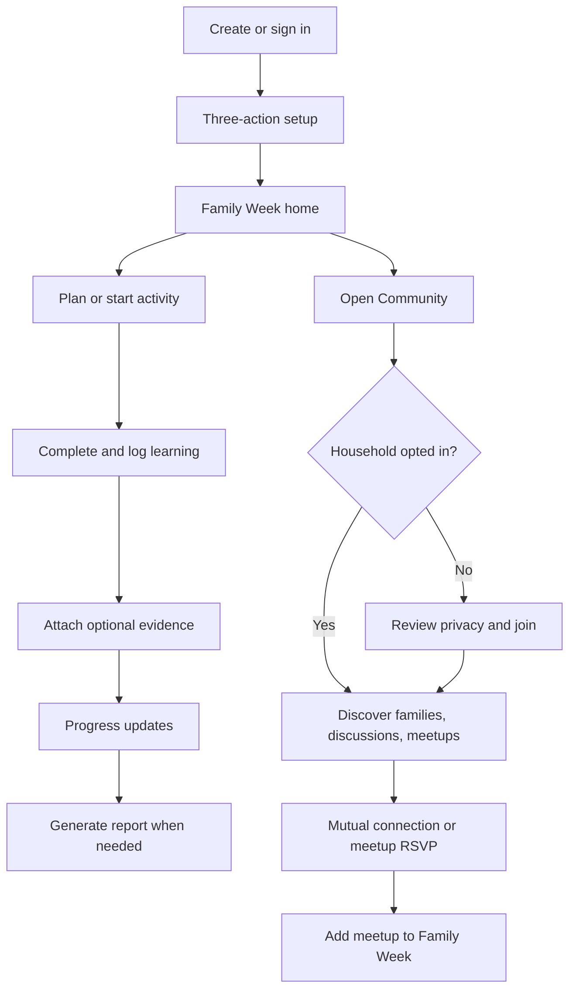

# NexSteps Home and Community User Flows

| Field           | Value                        |
| --------------- | ---------------------------- |
| Owner           | Product Design / Virtual CTO |
| Status          | Draft for review             |
| Created         | 28 July 2026                 |
| Last updated    | 28 July 2026                 |
| Primary surface | Expo React Native mobile app |

**Related documents:**

- [`07-nexsteps-home.md`](../../NexStepsV2/07-nexsteps-home.md)
- [`08-community.md`](../../NexStepsV2/08-community.md)
- [`04-learning-module.md`](../../NexStepsV2/04-learning-module.md)
- [`04a-phase4-build-plan.md`](../../NexStepsV2/04a-phase4-build-plan.md)
- [`01-architecture-overview.md`](../../cee-vertical/01-architecture-overview.md)
- [`04-rbac-trust-zones-compliance.md`](../../cee-vertical/04-rbac-trust-zones-compliance.md)

## 1. Executive summary

NexSteps Home gives a homeschooling family the useful structure of an
organisation without making the parent operate school-administration software.
The product should answer four questions quickly:

1. What are we doing this week?
2. What should we do next today?
3. What learning have we recorded?
4. Where can we find safe, welcoming community?

The approved experience begins with a three-action setup flow. Once the parent
adds a child, chooses learning days, and plans the first activity, the setup
surface permanently becomes the family's weekly home screen.

Community is a core product pillar, not a settings add-on. It therefore receives
its own top-level navigation tab. Community remains opt-in and off by default.
Parents can discover other opted-in households, exchange mutually accepted
introductions, join discussions, and arrange meetups. Community is adults-only
by construction: no child name, age, photo, profile, learning record, evidence,
or attendance information is exposed through any Community screen or API.

## 2. Problem statement

Home-educating parents frequently assemble their operating system from
calendars, notes, photo albums, messaging groups, spreadsheets, and memory. This
creates avoidable cognitive load and makes progress reporting difficult.
Finding other families often depends on fragmented social-media groups that
offer weak privacy boundaries and inconsistent moderation.

NexSteps Home should provide:

- a calm weekly rhythm rather than a dense dashboard;
- fast planning and learning capture;
- organised evidence and report generation;
- household calendar and tasks;
- a safe, appealing way to find and meet other families;
- obvious privacy controls with no tutorial required.

## 3. Goals

- A first-time parent understands the next action within two seconds.
- Initial setup can be completed in under three minutes.
- A routine learning activity can be logged in under 30 seconds.
- The current week remains the default organising metaphor.
- Community is inviting enough to create participation while remaining
  safeguarding-first.
- Every feature has clear loading, empty, success, validation, permission, and
  recoverable error states.
- Household data remains tenant-isolated.
- Cross-household Community access is narrow, explicit, opt-in, and auditable.

## 4. Non-goals

- Recreating a school MIS for the home.
- Showing attendance percentages as the main measure of a family's success.
- Public social networking or search-engine-indexed Community content.
- Child accounts, child-to-child messaging, or child-authored Community content
  in the MVP.
- Exposing child details to improve family matching.
- User-created Community channels in the MVP.
- Home-address meetups in the MVP.
- Anonymous posting.
- Public or unauthenticated report-bundle links.
- Real-time group chat, voice calling, or video calling.
- Automated curriculum recommendations.

## 5. Product principles

### 5.1 Teach through action

Do not add tutorial carousels, coach marks, or product tours. Each empty state
contains one plain-language action that creates useful data.

### 5.2 One primary action per screen

Supporting actions may be visible, but only one action receives the primary mint
button treatment.

### 5.3 Use family language

Use `learning day`, `activity`, `family week`, and `learning record`. Avoid
`tenant`, `organisation`, `session register`, `pupil`, and `attendance rate` in
the parent experience.

### 5.4 Privacy is visible

Parents should understand what is private, what is shared, and with whom without
opening legal copy. Community sharing controls include a live profile preview.

### 5.5 Community requires mutuality

Finding a family does not reveal contact information or open a direct message.
One adult sends a connection request; another adult accepts it before a private
introduction thread is created.

### 5.6 Design for interruption

Draft setup, activities, posts, and meetup forms persist locally and resume
without data loss after a call, app close, or short network interruption.

## 6. Assumptions and recommended product decisions

These decisions resolve gaps in the source documents for the purpose of a
coherent user flow. They require product approval before implementation.

1. **Household model:** one lightweight `Org` with one `Tenant` per household.
   This matches the Phase 7 recommendation and keeps billing and privacy
   boundaries clear.
2. **Navigation:** Community becomes a fifth top-level tab because it is a key
   product feature. The tab bar is `Week`, `Today`, `Community`, `Progress`,
   `Family`.
3. **Directory opt-in:** the household owner can enable Community. All active
   adult guardians are notified, any adult guardian can pause household
   discoverability immediately, and each adult separately controls whether
   their identity appears.
4. **Connection requests:** introduce a small `CommunityConnection` domain or a
   connection-scoped `CommunityThread`. A directory without a safe introduction
   path does not satisfy the key user outcome.
5. **Community MVP is adult-authored text:** no Community media attachments.
   This sharply reduces child-photo leakage and moderation burden. Household
   learning evidence remains private and may include media.
6. **Community location:** store and display only a coarse locality or region.
   Do not expose exact distance, household coordinates, postcode, or address.
7. **Meetup venues:** MVP meetups use public venues or a coarse online location.
   Private home addresses are not supported.
8. **Moderation:** a dedicated platform-level Community Moderator role reviews
   cross-household reports. Org-scoped administrators cannot moderate other
   households.
9. **Learning rhythm:** use logged learning days and completed activities rather
   than attendance percentages as the default parent-facing measure.
10. **Commercial gate:** pricing is unresolved. The UX supports both a free
    entry plan and a paid/trial gate without embedding a price in product copy.

## 7. Information architecture

### 7.1 First-run stack

### 7.2 Permanent navigation

- **Week:** the family's planning home and current weekly rhythm.
- **Today:** activities, tasks, quick learning capture, and completion.
- **Community:** families, discussions, connections, and meetups.
- **Progress:** child-focused logs, evidence, subjects, and reports.
- **Family:** people, learning preferences, membership, notifications, privacy,
  and account controls.

### 7.3 Global controls

- Notification bell in the top-right of permanent screens.
- Child switcher appears only where child context changes the content.
- Search is local to the surface using it; there is no global search in MVP.
- Back preserves the draft state of the current flow.
- Destructive actions use explicit confirmation and explain the consequence.

## 8. Roles and permissions

### 8.1 Household Owner

- Creates the household and subscription.
- Adds children and guardians.
- Controls billing and household-level Community participation.
- Can plan, log, upload evidence, and generate reports.

### 8.2 Adult Guardian

- Sees only children linked to the guardian.
- Can plan and log learning when granted household edit access.
- Can join Community if the household is opted in.
- Can pause household Community discoverability immediately.
- Controls whether their adult identity appears on the Community profile.

### 8.3 Tutor or Mentor

- Optional invited adult role.
- Access is explicitly scoped to selected children and learning features.
- Cannot manage billing or household Community discoverability by default.
- Cannot represent the household in Community unless separately approved.

### 8.4 Community Moderator

- Platform-level role with access only to the moderation surface and required
  content snapshots.
- Can restore, remove, warn, temporarily restrict, or suspend.
- Cannot access private household learning records.
- Every moderation view and action is audited.

## 9. End-to-end parent journey

## 10. Account creation, sign-in, and recovery

### 10.1 Create a family account

**Entry:** first app launch, `Create your family`.

**Happy path:**

1. Parent enters name, email, and password or uses an approved identity provider.
2. Parent accepts Terms, Privacy Notice, and confirms they are an adult.
3. App sends email verification.
4. Parent verifies and returns through a deep link.
5. App creates the household boundary and marks the parent as Household Owner.
6. App opens `Add your children`.

**States and alternatives:**

- Existing email: offer `Sign in` and `Reset password`; do not disclose whether
  an account belongs to a particular family.
- Verification link expired: offer a single `Send a new link` action.
- Offline after form submission: retain input and show `We'll continue when
you're back online`.
- Identity-provider cancellation: return to the welcome screen without error.
- Rate limiting: plain message with retry time; never reveal authentication
  internals.

### 10.2 Sign in

1. Parent enters credentials.
2. App restores the most recent authorised household and route.
3. Incomplete setup resumes at the first incomplete action.
4. Completed setup opens the current Week.
5. If the user belongs to more than one authorised space, show a simple space
   chooser after authentication.

### 10.3 Password reset

1. Parent enters email.
2. Always show the same confirmation.
3. Reset link opens a secure password form.
4. Successful reset revokes existing sessions according to Auth0 policy.
5. Parent signs in and returns to the prior safe route.

## 11. Plan selection and purchase

Pricing remains an open decision, so this flow is conditional.

### 11.1 Free or trial entry

1. Account creation immediately starts the available free/trial entitlement.
2. The app shows the entitlement in `Family > Membership`.
3. Seven days before a trial ends, notify the household owner.
4. Upgrade opens a web-based Stripe checkout or native-compliant purchase
   route, depending on App Store policy at implementation time.
5. After checkout, the app refreshes entitlements and returns to the prior
   screen.

### 11.2 Paid-before-use entry

1. After account verification, show the available NexSteps Home plan.
2. Explain outcomes, not modules: plan, record, report, and connect.
3. Parent selects billing frequency.
4. Stripe-hosted checkout collects payment.
5. Success returns to `Add your children`.
6. Cancellation returns to plan selection with no household data loss.
7. Webhook delay shows `Confirming your membership` and polls safely.

### 11.3 Payment failure

- Keep household data read-only during a grace period.
- Explain which actions are unavailable.
- `Update payment method` is the only primary action.
- Never block access to privacy export or account-deletion controls.

## 12. First-run setup

The setup screen shows all three actions as one ascending path to the Home mark.
Only the current action is interactive.

### 12.1 Add children

**Required fields:** preferred name, date of birth or age band, optional profile
colour. Legal name is collected only where reporting requires it and is clearly
labelled private.

**Flow:**

1. Parent taps `Add your first child`.
2. Parent enters the minimum required information.
3. App validates dates and required fields inline.
4. Parent saves.
5. A private child record is created in the household tenant.
6. App offers `Add another child` as a secondary action.
7. `Continue` advances to learning days.

**Errors and safeguards:**

- Duplicate likely match: warn and allow review; do not silently merge.
- Save failure: keep the form and support retry.
- Child data is never used to pre-populate Community.

### 12.2 Choose learning days

1. Show Monday to Sunday as large toggles.
2. Preselect Monday to Friday as an editable convenience, not a recommendation.
3. Parent selects typical learning days.
4. Parent chooses `Flexible week` if no fixed rhythm is wanted.
5. Optional time windows stay collapsed under `Add usual times`.
6. Save creates the household's default week template.
7. App advances to first activity.

**Validation:**

- At least one day or `Flexible week` is required.
- Overlapping optional time windows are highlighted before save.

### 12.3 Plan the first activity

1. Preselect the first child.
2. Parent enters activity title.
3. Parent optionally chooses subject, date, time, duration, and notes.
4. Default date is the next selected learning day.
5. Parent taps `Plan activity`.
6. Setup path completes and subtly transitions to Family Week.
7. The new activity appears in the correct day and becomes the next action.

### 12.4 Skip and resume

1. `I'll do this later` opens Week.
2. Week shows one focused setup surface: `Finish setting up your family`.
3. Completed setup actions remain checked.
4. Parent resumes the first incomplete action.
5. No blank dashboard or tutorial is shown.

## 13. Week home

### 13.1 Normal state

1. Week opens on the real containing week and selects today.
2. Header shows `Your family week`.
3. Day strip allows a one-tap date change.
4. `Today's rhythm` groups activities by child with lightweight dividers.
5. A single contextual note may appear, such as a free afternoon or overdue
   task.
6. Primary action is `Add today's learning`.
7. Secondary action is `Adjust this week`.
8. An opted-in household may see one small Community row for the next accepted
   meetup, never a generic social feed.

### 13.2 Empty week

1. Explain `Nothing planned yet`.
2. Primary action: `Plan your first activity`.
3. Secondary action: `Log something you already did`.
4. Do not add placeholder metrics.

### 13.3 Change week

1. Swipe or use previous/next controls.
2. `This week` returns to the current containing week.
3. Future weeks allow planning.
4. Past weeks are read-only at the week level, while individual records remain
   editable according to retention policy.

### 13.4 Move an activity

1. Parent opens activity details.
2. Taps `Move`.
3. Chooses a new date/time.
4. Conflicts show the overlapping item and offer `Move anyway` or `Choose
another time`.
5. Save updates Week and Today.

## 14. Today

### 14.1 Start a planned activity

1. Today orders activities by time, then untimed items.
2. Parent taps the next activity.
3. Activity sheet shows child, subject, planned duration, resources, and notes.
4. Parent taps `Start activity`.
5. The activity enters `In progress`; timer is optional and dismissible.
6. Parent taps `Finish and log`.
7. Quick learning log opens with planned values prefilled.

### 14.2 Log an unplanned activity

1. Parent taps `Add today's learning`.
2. Chooses child and enters title.
3. Optional subject and duration are suggested from recent choices.
4. Parent records a short note or simply saves.
5. The activity appears as complete in Today and Week.

### 14.3 Mark as skipped

1. Parent opens the activity overflow menu.
2. Chooses `Skip for today`.
3. App offers `Move to another day` or `Leave unplanned`.
4. Skipped activities are not treated as failure or negative progress.

## 15. Subjects

### 15.1 Add a subject

1. Entry points: activity form or `Progress > Subjects`.
2. Parent chooses a suggested subject or creates a custom subject.
3. Required field is name; colour/icon are optional.
4. Save returns the subject to the originating form.

### 15.2 Edit or archive

1. Editing a name updates future and historic display labels.
2. Archive removes the subject from new selections.
3. Historic learning logs keep the archived subject reference.
4. Delete is unavailable while records reference the subject.

## 16. Household calendar

### 16.1 Create a calendar item

1. Parent opens Week and taps a date, then `Add`.
2. Chooses `Learning activity`, `Family event`, `Task deadline`, or `Meetup`.
3. Enters relevant details.
4. Optional recurrence supports weekly and custom weekday patterns.
5. Save updates Week and Today.

### 16.2 Recurring activity

1. Parent chooses recurrence.
2. App previews the next four occurrences.
3. Parent saves the series.
4. Editing asks `This activity` or `This and future activities`.
5. Conflicts are warnings, not hard blocks.

### 16.3 Community meetup integration

1. Accepted RSVP offers `Add to Family Week`.
2. App stores a household-private calendar reference to the meetup.
3. Cancellation or time change updates the calendar reference and notifies the
   parent.
4. No child is assigned automatically.

## 17. Household tasks

### 17.1 Create a task

1. Entry points: Today, Week day menu, or activity details.
2. Parent enters task title.
3. Optional due date, related activity, and responsible adult.
4. Save adds the task to Today when due.

### 17.2 Complete a task

1. Parent taps the checkbox.
2. Completion animates once and moves the item below incomplete tasks.
3. Undo is available briefly.
4. Task completion does not create a learning log unless explicitly linked.

### 17.3 Overdue tasks

- Show at the top of Today with neutral wording.
- Offer `Do today`, `Move`, and `Complete`.
- Do not use red for ordinary overdue household tasks.

## 18. Learning logs

### 18.1 Create a quick log

1. Choose child.
2. Activity title is required.
3. Date defaults to today.
4. Subject, duration, notes, and outcome are optional.
5. Parent taps `Save learning`.
6. Success updates Today, Week, and Progress without an extra confirmation
   screen.

### 18.2 Add reflection

1. Optional prompt: `What went well?`
2. Parent may add a sentence or skip.
3. Reflection stays private to the household.
4. It may be included in reports only when the parent selects it.

### 18.3 Edit or remove

1. Parent opens a log from Progress.
2. Edit preserves evidence links.
3. Remove explains report impact and requires confirmation.
4. Soft deletion follows retention and audit policy.

## 19. Evidence

### 19.1 Attach evidence to a learning log

1. After saving a log, parent taps `Add evidence`.
2. Chooses camera, photo library, or file.
3. App requests OS permission only at the moment it is needed.
4. Preview shows the selected item.
5. Parent adds an optional private caption.
6. Upload progress is visible.
7. Success returns to the learning record.

### 19.2 Add general evidence

1. `Progress > Evidence` offers `Add work sample`.
2. Parent selects child and file.
3. Linking to a learning log is optional.
4. Save creates a valid standalone Evidence record.

### 19.3 Upload failure

- Keep a local retry item.
- Show `Waiting to upload` without blocking the rest of the app.
- Parent may retry or remove the pending item.
- Never expose a private storage URL.

## 20. Learning rhythm

The underlying platform may reuse attendance/session concepts, but the parent
surface uses non-institutional language.

### 20.1 Record a learning day

1. Completing the first learning activity on a date marks that date as a
   learning day.
2. Parent may manually mark a learning day from Today when learning happened
   away from the app.
3. Progress shows days with recorded learning, not an attendance percentage.

### 20.2 Review rhythm

1. Progress shows a simple month view of recorded learning days.
2. Selecting a day opens its logs.
3. No red absences or punitive streaks.
4. Reports may include the date summary where useful.

## 21. Progress

### 21.1 Child overview

1. Progress opens with the first child or last selected child.
2. Child switcher changes the whole surface.
3. Show recent learning, subject coverage, evidence, and learning-day rhythm.
4. Use descriptive summaries, not comparative scores.
5. Primary action is `View learning history`.

### 21.2 Learning history

1. Reverse chronological list grouped by week.
2. Filters: subject and date range.
3. Search matches activity titles and private notes.
4. Selecting a record opens details and evidence.
5. Empty filter result offers `Clear filters`.

### 21.3 Evidence gallery

1. Private gallery grouped by month.
2. Tapping opens a secure preview.
3. Multi-select supports report inclusion, download, or removal where permitted.
4. Child photos and work samples never appear in Community.

## 22. Report bundles

### 22.1 Request a report

1. Parent opens `Progress > Reports`.
2. Chooses child and date range.
3. Selects content: learning summary, logs, evidence index, and reflections.
4. App explains that the first build may be CSV-backed even if the surface calls
   it a report bundle.
5. Parent taps `Generate report`.
6. A `PENDING` report item appears immediately.

### 22.2 Generation lifecycle

1. `PENDING` displays `Queued`.
2. `GENERATING` displays progress-neutral copy: `Building your report`.
3. `READY` sends an in-app notification and enables `Download`.
4. `FAILED` shows `Try again`; technical details remain in logs.
5. Screen polling uses backoff and stops when the app backgrounds.

### 22.3 Download

1. Parent taps `Download`.
2. Authenticated API authorises household and child relationship.
3. File streams without exposing the private storage key.
4. Native share sheet appears only after the secure download completes.
5. Public share links are out of scope.

## 23. Household people and permissions

### 23.1 Invite an adult

1. Household Owner opens `Family > People`.
2. Taps `Invite adult`.
3. Enters email and chooses Guardian or Tutor/Mentor.
4. For Tutor/Mentor, selects permitted children and read/edit scope.
5. Invitee accepts through a secure link.
6. Existing account joins the household; new user creates an adult account.

### 23.2 Change or revoke access

1. Owner opens the adult's access summary.
2. Changes permissions or taps `Remove access`.
3. Removal explains effects before confirmation.
4. Session and refresh-token revocation follow auth policy.
5. Audit records the change without copying child data into general logs.

## 24. Community entry and opt-in

The Community tab is always visible to NexSteps Home users. Before opt-in it is
an inviting, privacy-led preview rather than a disabled screen.

### 24.1 Community preview

1. Header: `Find your people`.
2. Three concise benefits:
   - Meet other home-educating parents.
   - Join useful conversations.
   - Find welcoming local meetups.
3. Safety promise is visible: `Adults only. Your children's details stay
private.`
4. Primary action: `Join Community`.
5. Secondary action: `How privacy works`.
6. No directory results, posts, or meetup details are shown before opt-in.

### 24.2 Join Community

1. Show exactly what becomes visible and what remains private.
2. Parent confirms they are joining as an adult.
3. Parent chooses a household display name.
4. Parent selects coarse area or region, or chooses not to share location.
5. Parent selects optional household interests and typical availability.
6. Parent chooses whether their own adult name is shown.
7. Live preview shows the exact directory card.
8. Parent accepts Community Guidelines.
9. Parent taps `Join Community`.
10. Household opt-in becomes active; other adult guardians are notified.
11. Community home opens with `Find families` as the primary action.

### 24.3 Join validation

- Household display name cannot contain contact details.
- Location autocomplete stores only approved locality granularity.
- Interests cannot be free text in MVP; use moderated choices.
- Community profile has no child-related fields.

### 24.4 Pause or leave

1. `Community > Settings > Pause profile` immediately removes the household from
   discovery while retaining connections and content.
2. `Leave Community` removes access to directory, channels, and meetups.
3. Existing content follows the approved retention policy.
4. Other guardians are notified.
5. Rejoining requires reviewing current Guidelines and profile visibility.

## 25. Community home

### 25.1 Normal state

Use one vertically ordered page, not a dashboard grid:

1. A warm header and a single `Find families` primary action.
2. `Families you may like to meet`: up to three privacy-safe recommendations.
3. `Coming up`: the next two public-venue meetups.
4. `Conversations`: recent threads from followed channels.
5. `See all` opens the relevant sub-surface.

### 25.2 New member state

1. Show `Start with one small hello`.
2. Recommend completing one missing profile field if needed.
3. Primary action remains `Find families`.
4. Secondary options: browse discussions or meetups.

### 25.3 No local results

1. Explain that the community is still growing.
2. Offer `Expand area` without revealing exact radius.
3. Offer online discussions and virtual meetups.
4. Allow a notification when new opted-in households appear in the selected
   area, without exposing the parent's precise location.

## 26. Find families and connections

### 26.1 Browse directory

1. Parent opens `Find families`.
2. Results display chosen household name, coarse area, shared interests,
   typical availability, and opted-in adult contact name if allowed.
3. Filters: area grouping, interests, availability, and `Open to meetups`.
4. Sort defaults to relevant and recently active without displaying activity
   timestamps.
5. Results never display children, child count, ages, photos, learning stage,
   records, or exact distance.

### 26.2 View household profile

1. Parent opens a directory card.
2. Profile repeats exactly the fields shown in the owner's live preview.
3. Shared Community contributions may be visible.
4. Primary action is `Send a hello`.
5. Overflow contains `Block` and `Report profile`.

### 26.3 Send a hello

1. Parent taps `Send a hello`.
2. Chooses one short moderated prompt:
   - `Would you like to connect?`
   - `Interested in a local meetup?`
   - `We share some interests. Say hello?`
3. Optional note is limited in length and scanned for contact details.
4. Sender previews exactly what the recipient will see.
5. Send creates a pending connection request, not a direct message.
6. Sender can withdraw while pending.

### 26.4 Accept or decline

1. Recipient sees the adult sender and household profile.
2. Recipient chooses `Accept`, `Decline`, `Block`, or `Report`.
3. Decline sends no reason and prevents repeated requests for a cooldown period.
4. Accept creates a private adult-to-adult introduction thread.
5. Neither party receives private email, phone, or address data.

### 26.5 Connected conversation

1. Thread begins with both profile summaries and a safety reminder.
2. Adults exchange text messages.
3. Sharing direct contact details is a deliberate user action with a warning.
4. Either adult can disconnect, block, or report.
5. Disconnect closes new messages but preserves moderation evidence according to
   retention policy.

## 27. Community channels, threads, posts, and replies

### 27.1 Browse channels

1. Parent opens `Community > Conversations`.
2. MVP channels are platform-curated, for example:
   - Getting started
   - Local outings
   - Learning ideas
   - Resources
   - Parent support
3. Channel rows show description and unread count.
4. Parent follows or unfollows a channel.

### 27.2 View threads

1. Channel opens a thread list ordered by recent meaningful activity.
2. Pinned Guidelines and moderator notices remain above regular threads.
3. Search is scoped to the selected channel.
4. Muted or reported content is absent.

### 27.3 Create a thread

1. Parent taps `Start a conversation`.
2. Chooses channel.
3. Adds title and body.
4. Composer reminds: `Please don't share children's names, photos, or personal
details.`
5. Preview shows the adult/household attribution.
6. Parent posts.
7. Thread opens at the new post.

### 27.4 Reply

1. Parent taps `Reply`.
2. Composer opens inline.
3. Draft autosaves locally.
4. Successful reply appears once; idempotency prevents duplicates.
5. Author can edit within the defined window; edited state is labelled.

### 27.5 Delete own content

1. Author taps `Delete`.
2. Confirm explains that replies may remain for conversation continuity.
3. Content becomes unavailable to members.
4. Moderation retention follows policy.

## 28. Meetups

### 28.1 Discover meetups

1. Parent opens `Community > Meetups`.
2. Upcoming list groups `Nearby`, `Online`, and `Further afield`.
3. Cards show title, date/time, coarse area, public venue type, host household,
   capacity status, and whether approval is required.
4. Filters: date, broad area, interest, online/in person, accessibility.
5. No attendee child information is shown.

### 28.2 Meetup details

1. Detail shows description, date/time, public venue, accessibility notes,
   capacity, host, Guidelines, and RSVP state.
2. Exact public venue may be shown only when the host intentionally publishes
   it.
3. Primary action is `Request to join` or `Join meetup`.
4. Parent enters total party size only; no child names or ages.
5. Parent may add a private accessibility note visible only to the host.

### 28.3 Instant RSVP

1. Parent taps `Join meetup`.
2. Confirms party size.
3. RSVP succeeds.
4. Offer `Add to Family Week`.
5. Host sees the adult/household and private aggregate headcount.

### 28.4 Approval-required RSVP

1. Parent taps `Request to join`.
2. Request enters `Pending`.
3. Host accepts or declines without requiring a reason.
4. Accepted parent receives venue details allowed for attendees.
5. Declined parent receives neutral copy.

### 28.5 Create a meetup

1. Parent taps `Plan a meetup`.
2. Enters title, description, interest category, date, start/end time.
3. Chooses online or an approved public venue.
4. Adds coarse area, capacity, accessibility notes, and RSVP approval mode.
5. Preview shows the public listing exactly.
6. Parent accepts host responsibilities.
7. Publish makes the meetup visible to opted-in households.

### 28.6 Manage a meetup

- Host reviews RSVPs without child data.
- Host can update details; material changes notify attendees.
- Cancellation requires confirmation and optional adult-safe reason.
- Cancelled event updates linked Family Week items.
- Host can remove an attendee and report behaviour.

### 28.7 Meetup safety

- No private residential address field in MVP.
- Location is never copied from a household profile.
- Host and attendee identities are adult/household identities.
- Emergency or safeguarding issues link to clear external emergency guidance
  and in-app reporting; the app does not claim to provide emergency response.

## 29. Community blocking, reporting, and moderation

### 29.1 Block a household

1. Parent opens overflow on a profile, thread author, connection, or meetup host.
2. Taps `Block household`.
3. Confirmation explains the immediate effect.
4. Block hides both households from each other's discovery and content where
   practical, prevents new connection requests, and closes private threads.
5. Block is reversible in Community settings.
6. The blocked household is not notified.

### 29.2 Report content or profile

1. Parent taps `Report`.
2. Selects reason from a short list.
3. Optional details are private to moderators.
4. Parent confirms.
5. Reported post/reply is immediately soft-hidden from members pending review,
   as required by Phase 8.
6. Reporter sees confirmation and can also block.
7. Repeated taps are idempotent.

### 29.3 Report meetup

1. Report preserves a moderator-only snapshot of meetup details.
2. Meetup is hidden pending review when the report policy threshold is met; a
   severe safety reason may hide it immediately.
3. Existing attendees receive neutral cancellation/pending-review copy.
4. Exact reporter identity is never shown to the reported adult.

### 29.4 Moderator review

1. Moderator opens the cross-household moderation queue.
2. Queue prioritises severe and time-sensitive meetup reports.
3. Moderator views the minimum content snapshot, report reason, relevant adult
   account history, and prior actions.
4. Moderator chooses:
   - Restore content.
   - Remove content.
   - Warn adult.
   - Temporarily restrict posting or hosting.
   - Suspend Community access.
   - Escalate internally.
5. Resolution notes are required for action.
6. Outcome is audited.
7. Member notification reveals only the decision necessary for them.

### 29.5 Appeals

1. Actioned member may submit one appeal from the notification.
2. Appeal is reviewed by a different authorised moderator where feasible.
3. Evidence retention and appeal windows follow the approved retention policy.

## 30. Notifications

### 30.1 Notification centre

Group notifications into:

- `Family`: activity reminders, task deadlines, report readiness.
- `Community`: connection requests, replies, meetup RSVP changes, moderation
  decisions.

Each notification deep-links to an authorised screen. If access has changed,
show a neutral unavailable state.

### 30.2 Preferences

1. Parent opens `Family > Notifications`.
2. Controls push and email separately.
3. High-value categories are individually configurable.
4. Safety and account-security notifications cannot be fully disabled.
5. Default Community digest is restrained to avoid social pressure.

## 31. Family settings, privacy, export, and deletion

### 31.1 Family profile

- Manage household display name used privately.
- Community display name remains a separate explicitly shared field.
- Manage learning days, subjects, children, adults, and permissions.

### 31.2 Membership

- View plan and renewal state.
- Manage payment through the approved Stripe flow.
- Show feature access in customer language.

### 31.3 Data export

1. Household Owner opens `Privacy and data`.
2. Requests household or child-specific export.
3. App confirms scope and identity as required.
4. Export generates asynchronously.
5. Secure authenticated download is available for a limited time.
6. Community report/moderation data is handled according to legal rights and
   safeguarding exemptions.

### 31.4 Delete account or household

1. Explain difference between leaving a household, deleting an adult account,
   and closing the whole household.
2. Require recent authentication.
3. Show consequences for reports, learning evidence, invited adults, Community
   profile, connections, posts, and meetups.
4. Offer export first.
5. Apply retention, soft-delete, and legal-hold rules.
6. Confirm completion without exposing deleted details.

## 32. Cross-cutting states

### 32.1 Loading

- Prefer skeleton rows matching final geometry.
- Do not block the entire app for one slow section.
- Preserve selected tab, week, child, and filters.

### 32.2 Empty

- Explain why the screen is empty.
- Provide one action that creates useful data.
- Never use empty metrics, fake examples, or generic illustrations as a
  substitute for action.

### 32.3 Offline

- Existing private household data may be read from an encrypted local cache.
- New learning logs and task changes queue safely.
- Community posting, connection requests, and RSVPs require a confirmed network
  response and clearly remain unsent until then.
- Never show an optimistic Community success that the server has not accepted.

### 32.4 Permission denied

- Explain the parent-safe reason and next action.
- Do not expose role names, capability strings, tenant IDs, or resource
  existence across households.

### 32.5 Deleted or unavailable Community content

- Use `This is no longer available`.
- Do not reveal whether content was deleted, reported, moderated, or hidden due
  to the viewer's membership state.

## 33. Screen and route inventory

Final route names should follow the existing Expo Router conventions.

### 33.1 Authentication and setup

- Welcome
- Create account
- Sign in
- Verify email
- Recover account
- Add children
- Choose learning days
- Plan first activity

### 33.2 Week and Today

- Week
- Day details
- Plan activity
- Activity details
- Today
- Quick learning log
- Task create/edit
- Calendar item create/edit

### 33.3 Progress

- Child progress overview
- Learning history
- Learning-log detail/edit
- Evidence gallery/detail/upload
- Subjects
- Reports list
- Report request/detail/download

### 33.4 Community

- Community preview
- Community join/privacy preview
- Community home
- Family directory
- Household profile
- Connection requests
- Private introduction thread
- Channels
- Threads
- Thread detail/composer
- Meetups
- Meetup details
- Create/manage meetup
- Community settings
- Blocked households
- Report confirmation

### 33.5 Family

- Children
- Child details
- People and permissions
- Learning preferences
- Notifications
- Membership
- Privacy and data
- Account/session controls

### 33.6 Platform moderation

- Report queue
- Report detail
- Member/content history
- Resolution and audit detail

## 34. Terminology and copy rules

| Avoid                       | Use                            |
| --------------------------- | ------------------------------ |
| Organisation dashboard      | Family Week                    |
| Attendance rate             | Learning rhythm                |
| Pupil                       | Child or learner               |
| Session register            | Today's activities             |
| Create record               | Save learning                  |
| Directory opt-in capability | Join Community                 |
| Tenant/site                 | Family or household            |
| Generate bundle job         | Build report                   |
| Error 403                   | You do not have access to this |
| No data                     | Nothing here yet               |

Community safety copy must be direct without sounding alarming. Prefer:

- `Your children's details stay private.`
- `Only opted-in adults can see Community.`
- `Share a broad area, never your home address.`
- `Connect only after both adults agree.`

## 35. Visual and interaction system

- White base surface.
- NexSteps mint `#76D7C4` for primary actions and current navigation.
- NexSteps yellow `#FFD166` for one current-focus highlight.
- Charcoal `#333333` for readable text and text on mint/yellow.
- Nunito for headings; Quicksand for body.
- 18–24px primary surface radius.
- Minimum 44x44pt touch target.
- Restrained shadows; use spacing and dividers first.
- No nested cards.
- Motion is brief, optional, and respects reduced-motion settings.
- The setup steps-to-home motif becomes the selected-day and progress language
  in the permanent app.

## 36. Accessibility

- WCAG 2.2 AA contrast for text and controls.
- Charcoal text on mint/yellow; do not rely on white text over light brand
  colours.
- Dynamic type support without clipped labels.
- Screen-reader labels include state, for example `Tuesday 28, selected`.
- Colour is never the only status signal.
- Form errors appear next to the field and in an accessible summary.
- Keyboard and switch-control traversal follows visual order.
- Reduced motion replaces transitions with immediate state changes.
- Community moderation and safety actions use unambiguous labels.

## 37. Security, privacy, and safeguarding

### 37.1 Private household zone

- Every child, learning log, evidence item, task, report, and calendar item is
  scoped to the household tenant.
- Guardian-child relationship is checked on every child-specific request.
- Private file access streams through authenticated API routes.
- Sensitive views and exports are audited.

### 37.2 Community zone

- Off by default.
- Read and write access requires current opted-in household membership.
- Community queries use a dedicated narrow cross-tenant path; no household-data
  guard is globally loosened.
- Community API DTOs contain no child fields.
- Coarse location only.
- Adult/household attribution only.
- Text-only MVP content.
- Blocking is immediate.
- Reported posts are soft-hidden immediately pending review.
- Moderator access is platform-level, least privilege, and audited.

### 37.3 Data minimisation checks

Automated contract tests must prove that no Community response can include:

- child ID;
- child name;
- date of birth or age;
- child photo or evidence;
- learning log or subject;
- attendance or learning-day record;
- child-linked contact details.

## 38. Analytics and success measures

Analytics must not contain child names, free-text learning notes, message text,
or precise location.

### 38.1 Activation

- Account creation completion.
- Setup completion and time to complete.
- First planned activity.
- First saved learning log.
- Seven-day return rate.

### 38.2 Household value

- Weekly active households.
- Activities planned and logged.
- Evidence uploads completed.
- Report bundles generated and downloaded.
- Task completion and calendar reuse.

### 38.3 Community value

- Community preview-to-opt-in conversion.
- Profile completion.
- Directory search success.
- Connection requests accepted.
- Time to first mutual connection.
- Meetup discovery-to-RSVP conversion.
- Repeat meetup participation.
- Healthy thread participation.

### 38.4 Community safety

- Reports per 1,000 posts.
- Median moderation response time.
- Percentage of immediately hidden content restored.
- Blocks per 1,000 connections.
- Repeat-offender rate.
- Meetup cancellations due to moderation.

## 39. Failure modes and mitigations

| Failure mode                                  | Mitigation                                                |
| --------------------------------------------- | --------------------------------------------------------- |
| Setup feels like administration               | Three actions only; optional fields collapsed             |
| Week becomes a dense dashboard                | One current-day group and one primary action              |
| Parents avoid Community due to privacy fear   | Live profile preview and explicit private/shared boundary |
| Directory feels useless                       | Mutual `Send a hello` connection flow                     |
| Community matching pressures child disclosure | No child fields or child-based filters                    |
| Exact location enables triangulation          | Coarse area buckets; no distance or coordinates           |
| Home-address meetup creates safeguarding risk | Public venues only in MVP                                 |
| Report abuse hides legitimate content         | Audit, moderator restoration, rate limits, appeals        |
| Malicious reports expose sensitive snapshots  | Minimum necessary moderator view and strict retention     |
| Offline state duplicates Community actions    | Server-confirmed mutations with idempotency keys          |
| Report generation is slow                     | Async lifecycle with notification and safe retry          |
| Payment webhook is delayed                    | Entitlement confirmation state with polling               |

## 40. Acceptance criteria

### 40.1 Setup and household

- A new parent reaches the first setup action without a tutorial.
- Setup resumes at the first incomplete action.
- Completing the first activity opens Week with real household data.
- Skipping setup never produces a dead-end empty dashboard.
- Household data is tenant-isolated and relationship-guarded.

### 40.2 Planning and learning

- Parent can plan, move, complete, skip, and log an activity.
- Parent can create household tasks and calendar items.
- Evidence works with or without a linked learning log.
- Progress is child-scoped and avoids punitive attendance language.
- Report generation exposes queued, generating, ready, and failed states.
- Report download is authenticated and never exposes a storage key.

### 40.3 Community

- Community is a top-level, appealing surface while remaining opt-in.
- A non-opted-in household sees no directory, thread, post, or meetup data.
- Joining includes a live preview of exactly what other adults can see.
- Directory responses contain no child-identifying data.
- Parents can discover households using only coarse area, adult availability,
  and household interests.
- Connection requires mutual adult consent before private conversation.
- Channels, threads, posts, and replies are available only to opted-in
  households.
- Meetups use adult/household RSVPs and public venues.
- No child name, age, photo, record, or evidence is reachable through Community
  under any opt-in combination.
- Blocking takes immediate effect.
- Reported posts are hidden immediately pending moderator review.
- Moderator actions are least-privilege and audited.

### 40.4 Quality

- All screens handle loading, empty, error, permission, and success states.
- Primary tasks meet 44x44pt touch targets and WCAG 2.2 AA contrast.
- Dynamic text does not clip at supported accessibility sizes.
- Core flows are covered by unit, API integration, and mobile E2E tests.

## 41. Recommended E2E journey coverage

1. New parent creates account, completes setup, and sees first Week.
2. Parent plans, starts, completes, and logs an activity.
3. Parent adds standalone evidence and later links it to a log.
4. Parent generates and downloads a report.
5. Household Owner invites a Guardian with restricted access.
6. Parent previews Community, opts in, and verifies the public profile.
7. Two opted-in households find each other and mutually connect.
8. Non-opted-in household cannot read directory or thread content.
9. Parent creates a thread and another parent replies.
10. Parent creates a public-venue meetup; another household RSVPs and adds it to
    Week.
11. Parent blocks a household and can no longer receive requests.
12. Parent reports a post; it disappears pending moderator review.
13. Moderator restores or removes the post and records resolution.
14. Contract test exhaustively rejects child fields from every Community DTO.

## 42. Open decisions requiring approval

1. NexSteps Home pricing and whether setup starts before payment.
2. Final household/guardian Community consent rule.
3. Whether private connection threads ship in Phase 8 MVP or immediately after.
4. Approved coarse-location granularity for UK and European users.
5. Community content and moderation retention periods.
6. Moderator staffing, operating hours, and escalation policy.
7. Whether all reported posts soft-hide globally on the first report or whether
   severe reasons use immediate global hide and other reasons use reporter-local
   hide plus thresholding. Phase 8 currently requires immediate global hide.
8. Meetup cancellation and incident-response runbook.
9. App Store-compliant purchase route for the NexSteps Home subscription.
10. CSV report bundle terminology at launch and the later PDF/evidence-archive
    roadmap.

## 43. Implementation handoff notes

- Extend the existing mobile route-group architecture; do not fork the backend.
- Reuse existing design tokens, fonts, primitives, and Expo Router patterns.
- Replace the current static Family Space data rather than layering new
  hardcoded content over it.
- Keep private household APIs and cross-household Community APIs in separate
  modules and policy paths.
- Treat `CommunityConnection` as a deliberate scope addition required by the
  directory's main user outcome.
- Keep Community text-only until moderation operations are proven.
- Preserve the source documents' fail-safe report behaviour unless the product
  owner explicitly approves a different policy.
- Produce implementation plans as small, reviewable PRs after this specification
  is approved.
